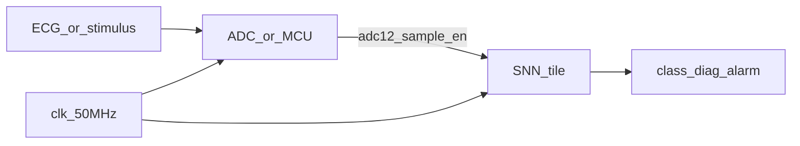
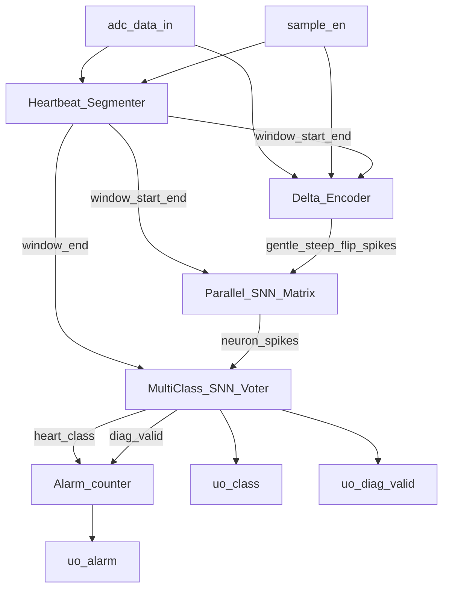
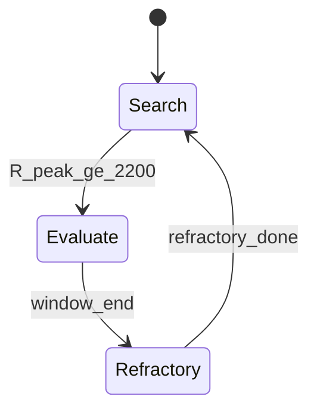
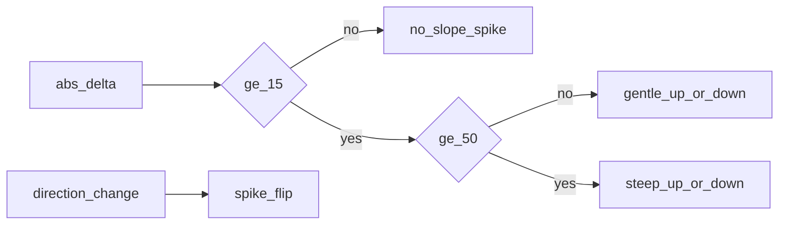

# Architecture — snn_lif_neurons

Digital **spiking neural network (SNN) heart-beat classifier** for Tiny Tapeout
(`tt_um_snn_lif_neuron`).

TT datasheet: [info.md](info.md) · Component sheet: [DATASHEET.md](DATASHEET.md) · User manual: [USER_MANUAL.md](USER_MANUAL.md)

Companion ADC: [heart_monitor_adc_ttsky26c](https://github.com/davidbroughsmyth/heart_monitor_adc_ttsky26c)

## System context

A 12-bit sample and `sample_en` enter the SNN each beat epoch. The tile outputs
class, `diag_valid`, and a persistence alarm.

## Pipeline block diagram

| Block | Role | Source |
|---|---|---|
| Heartbeat_Segmenter | R-peak detect, eval + refractory windows | [`Heartbeat_Segmenter.v`](../src/Heartbeat_Segmenter.v) |
| Delta_Encoder | Banded slope spikes + flip events | [`Delta_Encoder.v`](../src/Delta_Encoder.v) |
| Parallel_SNN_Matrix | 5 class-specific LIF neurons | [`Parallel_SNN_Matrix.v`](../src/Parallel_SNN_Matrix.v), [`Heart_Monitor_Neuron.v`](../src/Heart_Monitor_Neuron.v) |
| MultiClass_SNN_Voter | Winner at window end (`WIN_MARGIN`) | [`MultiClass_SNN_Voter.v`](../src/MultiClass_SNN_Voter.v) |
| Alarm logic | 3 consecutive anomaly classes | [`SNN_Heart_Monitor_Top.v`](../src/SNN_Heart_Monitor_Top.v) |
| TT wrapper | Pin map | [`project.v`](../src/project.v) |

## Beat classification flow

1. **Search** — wait for ADC ≥ `R_PEAK_THRESHOLD` (2200).
2. **Evaluate** (~200 ms at 500 SPS) — encoder emits gentle/steep up/down and flip spikes; five LIFs integrate; voter picks class at `window_end`.
3. **Refractory** (~300 ms) — ignore new peaks; then return to Search.
4. **Alarm** — on each `diag_valid`, classes 1/2/4 increment a streak; assert `alarm` at 3; classes 0/3 clear.

## Class map

| Class | Meaning | Typical morphology |
|---|---|---|
| 0 | Normal | Gentle rising slope |
| 1 | Supra-ventricular | Gentle falling slope |
| 2 | Ventricular | Steep rising slope |
| 3 | Fusion | Steep falling slope |
| 4 | Unknown / noise | Zigzag / direction flips |

Anomaly set for alarm: **1, 2, 4**.

## Key parameters

From [`SNN_Heart_Monitor_Top.v`](../src/SNN_Heart_Monitor_Top.v) (defaults):

| Parameter | Default | Meaning |
|---|---|---|
| `R_PEAK_THRESHOLD` | 2200 | R-peak ADC code |
| `DELTA_THRESHOLD` | 15 | Gentle slope band start |
| `STEEP_THRESHOLD` | 50 | Steep slope band |
| `SAMPLE_RATE_HZ` | 500 | Assumed sample rate |
| `EVAL_WINDOW_MS` | 200 | Post-peak integrate window |
| `REFRACTORY_MS` | 300 | Dead time after window |
| `ALARM_PERSIST_MAX` | 3 | Consecutive anomalies → alarm |
| `WIN_MARGIN` | 8 | Voter margin; else prefer class 4 |
| LIF `THRESHOLD` | 0x0800 | Neuron fire level |

## Encoder banding

Gentle vs steep separation avoids conflating Normal and Ventricular on similar edge signs.

## Two-tile demo

Wire companion ADC digital bus → this tile’s `ui`/`uio` as in the ADC
[INTEGRATION.md](https://github.com/davidbroughsmyth/heart_monitor_adc_ttsky26c/blob/main/docs/INTEGRATION.md).
Share `clk`, `rst_n`, GND.
