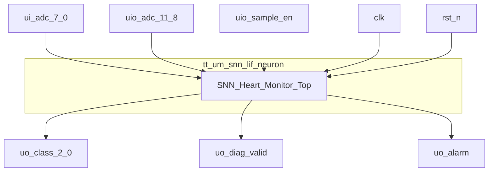
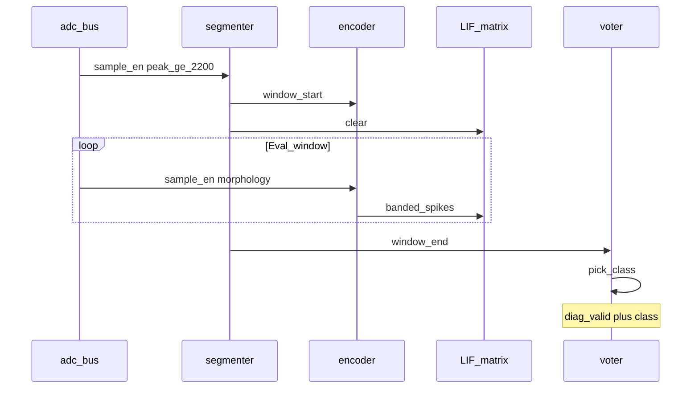
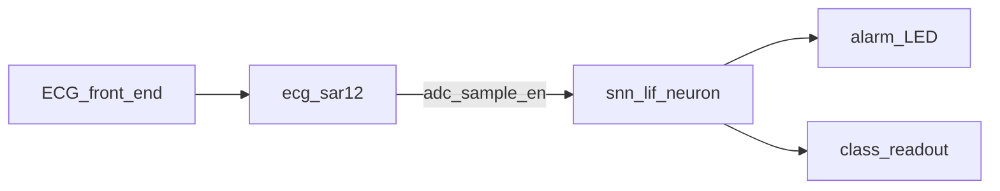

# tt_um_snn_lif_neuron

**5-Class · Banded LIF · Heart-Beat Morphology Classifier**

Tiny Tapeout SKY130 · Digital 1×2 tile · Spiking neural network

| | |
|---|---|
| Device | `tt_um_snn_lif_neuron` |
| Family | snn_lif_neurons |
| Process | sky130A |
| Package | TT digital tile 1×2 |
| Clock | 50 MHz |

---

## General Description

The **tt_um_snn_lif_neuron** is a compact spiking neural-network classifier for
ECG-like waveforms on Tiny Tapeout. Twelve-bit ADC samples enter on dedicated
digital pins with a `sample_en` strobe. An on-chip segmenter detects R-peaks,
opens a fixed evaluation window, and a delta encoder converts morphology into
gentle/steep directional spikes plus flip events. Five parallel leaky
integrate-and-fire (LIF) neurons (one per AAMI-style class) compete; a margin
voter emits the winning class with `diag_valid`. An alarm output asserts only
after three consecutive anomaly classifications.

---

## Features

- 5 parallel banded LIF neurons (classes 0–4)
- R-peak segmenter with evaluate / refractory timing at 500 SPS assumption
- Gentle vs steep delta bands (thresholds 15 / 50)
- Multi-class voter with win margin
- Alarm after 3 consecutive anomalies (classes 1, 2, 4)
- SNN-compatible ADC bus shared with companion SAR ADC tile

---

## Applications

- On-chip ECG morphology triage with Tiny Tapeout SNN
- Two-tile demo with [`heart_monitor_adc_art_ttsky26c`](https://github.com/davidbroughsmyth/heart_monitor_adc_art_ttsky26c) (fabrication companion)
- Lab bring-up with MCU-driven ADC + `sample_en`

---

## Connection Diagram

### Pin Configuration

| Pin | Name | Type | Function |
|---|---|---|---|
| `ui[7:0]` | adc[7:0] | I | Sample LSBs |
| `uio[3:0]` | adc[11:8] | I | Sample MSBs |
| `uio[4]` | sample_en | I | New-sample strobe |
| `uio[7:5]` | — | I | Unused (tie 0) |
| `uo[2:0]` | class[2:0] | O | Heart class 0–4 |
| `uo[3]` | diag_valid | O | Classification valid pulse |
| `uo[4]` | alarm | O | Persistence alarm |
| `uo[7:5]` | — | O | Unused |
| `clk` | clk | I | 50 MHz system clock |
| `rst_n` | rst_n | I | Active-low reset |
| `ena` | ena | I | Tile enable |

I = input, O = output.

---

## Absolute Maximum Ratings

| Parameter | Symbol | Rating | Unit |
|---|---|---|---|
| Digital supply | VDPWR | −0.3 to 2.0 | V |
| Digital I/O | — | −0.3 to VDPWR+0.3 | V |
| Storage temperature | Tstg | −65 to 150 | °C |

---

## Recommended Operating Conditions

| Parameter | Symbol | Min | Typ | Max | Unit |
|---|---|---|---|---|---|
| Digital supply | VDPWR | 1.62 | 1.80 | 1.98 | V |
| System clock | fclk | — | 50 | — | MHz |
| Sample rate (assumed) | fs | — | 500 | — | SPS |
| Ambient (lab) | TA | 0 | 25 | 70 | °C |

---

## Electrical / Functional Characteristics

Design targets at VDPWR = 1.8 V, fclk = 50 MHz, fs = 500 SPS.

| Parameter | Symbol | Conditions | Min | Typ | Max | Unit |
|---|---|---|---|---|---|---|
| ADC bus width | N | — | — | 12 | — | bits |
| R-peak threshold | VR | ADC code | — | 2200 | — | LSB |
| Gentle delta | Δg | abs ΔADC | 15 | — | 49 | LSB |
| Steep delta | Δs | abs ΔADC | 50 | — | — | LSB |
| Eval window | tE | — | — | 200 | — | ms |
| Refractory | tR | — | — | 300 | — | ms |
| Neuron count | — | parallel LIF | — | 5 | — | — |
| LIF threshold | θ | — | — | 0x0800 | — | — |
| Voter margin | WM | — | — | 8 | — | count |
| Alarm persistence | NA | anomaly streak | — | 3 | — | beats |
| Output class | — | — | 0 | — | 4 | — |

Power / timing closure: see GDS Action reports for the shuttle build.

---

## Timing Characteristics

| Parameter | Symbol | Min | Typ | Max | Unit |
|---|---|---|---|---|---|
| Clock period | tCLK | — | 20 | — | ns |
| sample_en capture | — | rising with valid adc | — | — | — |
| Eval samples | — | ~100 at 500 SPS | — | — | sample |
| diag_valid | — | 1 pulse per completed window | — | — | — |

### Classification sequence

---

## Functional Description

**Segmenter.** Detects R-peak, runs evaluate then refractory state machines sized
from `SAMPLE_RATE_HZ` and millisecond parameters.

**Encoder.** On each `sample_en` in-window, computes ΔADC; emits gentle or steep
up/down spikes and `spike_flip` on direction changes.

**Matrix.** Five LIFs with class-specific weights; cleared at `window_start`;
ticked on delayed `sample_en`.

**Voter.** Counts neuron spikes in-window; requires margin over runner-up or
defaults toward unknown (class 4).

**Alarm.** Streak of classes 1/2/4; clear on 0/3.

Architecture diagrams: [ARCHITECTURE.md](ARCHITECTURE.md).

---

## Typical Application

Baseline ADC ~150; R-peak ≥ 2200; slope morphology for ~100 samples after peak.

---

## Package Information

| | |
|---|---|
| Form factor | Tiny Tapeout digital |
| Tile size | 1×2 |
| Language | Verilog (hardened via TT GDS Action) |

---

## Ordering / Identification

| Field | Value |
|---|---|
| Part / top module | `tt_um_snn_lif_neuron` |
| Repository | https://github.com/davidbroughsmyth/snn_lif_neurons_ttsky26c |
| Shuttle family | TTSKY (sky130A) |
| Companion ADC | `tt_um_davidbroughsmyth_ecg_sar12` ([heart_monitor_adc_art_ttsky26c](https://github.com/davidbroughsmyth/heart_monitor_adc_art_ttsky26c)) |

---

*Preliminary datasheet — functional design targets. See CI GDS reports for silicon area/power.*

TT project sheet: [info.md](info.md) · User manual: [USER_MANUAL.md](USER_MANUAL.md)
