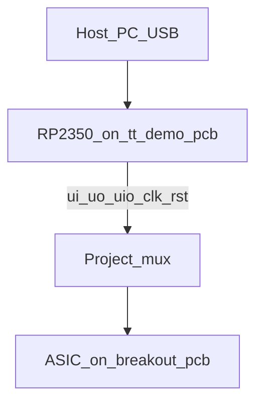
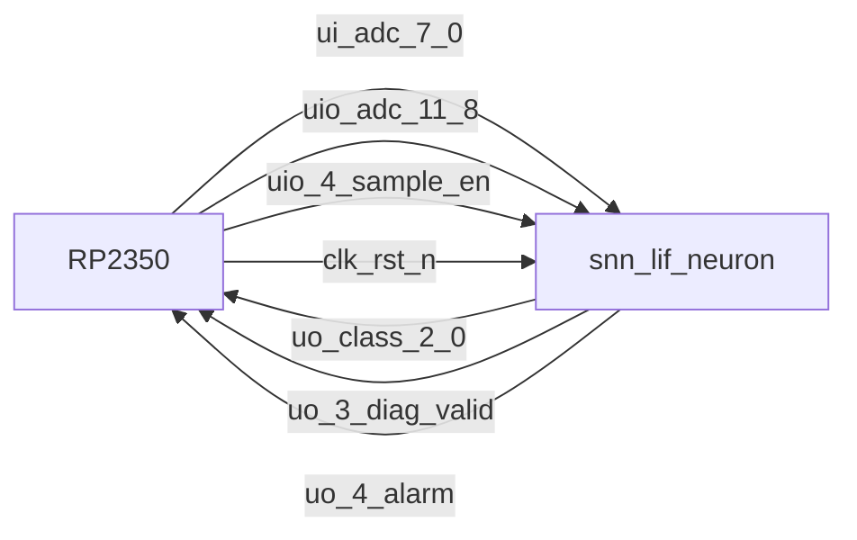
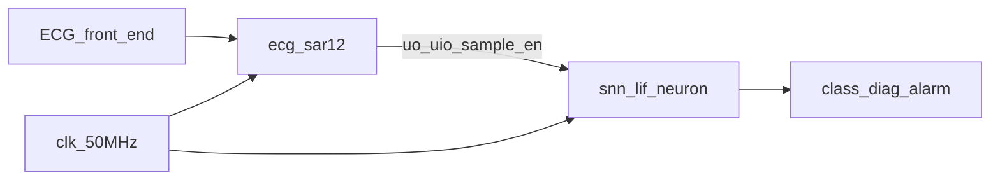
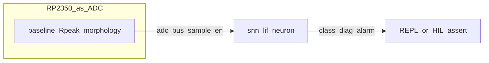
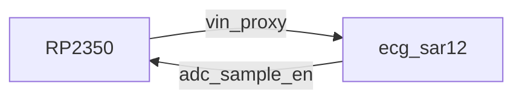
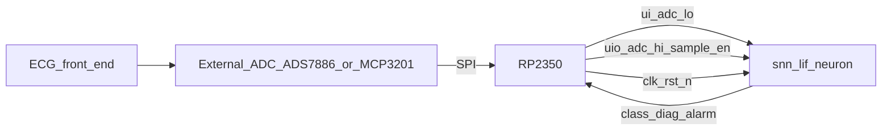
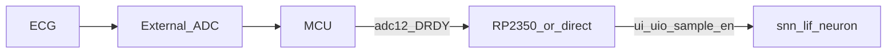

# User Manual — snn_lif_neurons on Tiny Tapeout demoboard

How to **use and test** `tt_um_snn_lif_neuron` alone, **with an external ADC chip**,
and **together with** the companion ADC `tt_um_davidbroughsmyth_ecg_sar12` using the
RP2350 on the Tiny Tapeout demo PCB.

| Doc | Link |
|---|---|
| Architecture | [ARCHITECTURE.md](ARCHITECTURE.md) |
| Component datasheet | [DATASHEET.md](DATASHEET.md) |
| MicroPython HIL scripts | [`../demoboard/`](../demoboard/) |
| Companion ADC manual | [ADC USER_MANUAL](https://github.com/davidbroughsmyth/heart_monitor_adc_ttsky26c/blob/main/docs/USER_MANUAL.md) |
| Two-tile wiring | [ADC INTEGRATION](https://github.com/davidbroughsmyth/heart_monitor_adc_ttsky26c/blob/main/docs/INTEGRATION.md) |

Firmware / board references:

- [tt-demo-pcb](https://github.com/TinyTapeout/tt-demo-pcb) (RP2350 demoboard)
- [breakout-pcb](https://github.com/TinyTapeout/breakout-pcb) (ASIC carrier)
- [tt-micropython-firmware](https://github.com/TinyTapeout/tt-micropython-firmware) (DemoBoard SDK + examples)

---

## 1. Hardware stack



1. ASIC sits on the **breakout**; breakout plugs into the **demoboard**.
2. Install a current **RP2350 UF2** from firmware [releases](https://github.com/TinyTapeout/tt-micropython-firmware/releases) (hold BOOT, copy UF2).
3. Open a serial REPL (`/dev/ttyACM0` or similar).

### Mux limitation (important)

The shuttle **enables one design at a time**. The RP2350 only sees that design’s pins.

| Scenario | Enabled project | What the RP2350 does |
|---|---|---|
| SNN alone / HIL | `tt_um_snn_lif_neuron` | Synthesize ADC-like samples + `sample_en`; read class / alarm |
| External ADC + SNN | `tt_um_snn_lif_neuron` | Read external ADC (e.g. SPI); drive SNN bus + `sample_en`; read class / alarm |
| Companion TT ADC alone | `tt_um_davidbroughsmyth_ecg_sar12` | Drive digital vin; read ADC bus (see ADC manual) |
| Two-tile silicon | both on chip, external wiring | INTEGRATION wiring; mux still shows one project’s pins to RP |

On the demoboard, **“combined with TT ADC” HIL** means: enable the **SNN** and have the
RP2350 **emulate** the ADC traffic. **External commercial ADCs** use the same SNN pin map;
the RP bridges SPI (or parallel) samples onto `ui`/`uio`.

---

## 2. Circuit diagrams

### 2.1 SNN alone (RP synthesizes ADC bus)



**Bidirectional OE:** SNN uses `uio` as inputs. On the Pico:

`tt.uio_oe_pico.value = 0xFF`  
(drive `uio[4:0]` as ADC[11:8] + `sample_en`).

### 2.2 Combined — logical (post-silicon tile wiring)



| ADC output | SNN input |
|---|---|
| `uo[7:0]` adc[7:0] | `ui_in[7:0]` |
| `uio[3:0]` adc[11:8] | `uio_in[3:0]` |
| `uio[4]` sample_en | `uio_in[4]` |

### 2.3 Combined — demoboard HIL (RP emulates ADC)



Same pin map as §2.1. Scripts: `demoboard/tt_um_snn_lif_neuron/`.

### 2.4 Optional: verify ADC companion first



Enable the ADC project and run companion HIL from
[heart_monitor_adc demoboard](https://github.com/davidbroughsmyth/heart_monitor_adc_ttsky26c/tree/main/demoboard)
before relying on real silicon ADC→SNN wiring.

### 2.5 External ADC chip → SNN (lab bridge)



Typical parts: **ADS7886**, **MCP3201**, or any 12-bit SAR whose host can present a
parallel sample + data-ready strobe. SPI ADCs hang off **free RP GPIOs** (not the
Tiny Tapeout project pin buses). The RP packs each conversion onto the SNN consumer
bus and pulses `sample_en`.

Optional variant — MCU already owns the ADC and emits parallel data:



---

## 3. Using the SNN alone

### 3.1 Stimulus recipe

| Phase | ADC code | `sample_en` |
|---|---|---|
| Baseline | ~150 | pulse each sample |
| R-peak | ≥ 2200 | pulse |
| Morphology | gentle Δ≈15–49 or steep Δ≥50 | ~100 pulses |
| Readout | — | wait for `uo[3]` `diag_valid`; class on `uo[2:0]` |

| Class | Typical morphology |
|---|---|
| 0 Normal | Gentle rising |
| 1 Supra | Gentle falling |
| 2 Ventricular | Steep rising |
| 3 Fusion | Steep falling |
| 4 Unknown | Zigzag / flips |

Alarm: **3 consecutive** classes in {1, 2, 4}; cleared by 0 or 3.

### 3.2 REPL smoke

```python
from ttboard.demoboard import DemoBoard
from ttboard.mode import RPMode

tt = DemoBoard.get()
tt.mode = RPMode.ASIC_RP_CONTROL
tt.shuttle.tt_um_snn_lif_neuron.enable()
# Fallback: tt.shuttle.find('snn')[0].enable()

tt.uio_oe_pico.value = 0xFF
tt.reset_project(True)
tt.reset_project(False)
tt.clock_project_PWM(1_000_000)
```

Prefer the packaged HIL (drives a full beat):

```python
import examples.tt_um_snn_lif_neuron as snn_hil
snn_hil.run()
```

### 3.3 Desktop RTL (no ASIC)

```sh
cd test
python3.13 -m venv .venv && source .venv/bin/activate
pip install -r requirements.txt
make -B
```

Includes synthetic class/alarm tests and MIT-BIH CSV stream smoke
(`test/data/mitbih_100_excerpt.csv`).

---

## 4. Setup and test with an external ADC chip

Use this when you have a **commercial ADC** (or MCU+ADC) and want to feed the SNN
before the on-shuttle SAR is available, or to compare against it.

### 4.1 Setup checklist

1. Common **GND** between ECG front-end, ADC, demoboard.
2. Power the ADC at its rated VDD; **level-shift** to 3.3 V logic if the ADC is 5 V
   before connecting to RP GPIOs.
3. Wire SPI (or parallel) from the ADC to **spare RP2350 GPIOs** — do not steal
   `ui`/`uo`/`uio` used for the Tiny Tapeout project bus.
4. Enable `tt_um_snn_lif_neuron`; `tt.mode = RPMode.ASIC_RP_CONTROL`;
   `tt.uio_oe_pico.value = 0xFF`.
5. Clock the project (`clock_project_PWM`, e.g. 1 MHz) and release reset.
6. Aim for ~**500 SPS** into the SNN (matches `SAMPLE_RATE_HZ`). Faster is OK for
   lab smoke tests; keep `sample_en` as a short pulse per sample.
7. Scale / offset so baseline is mid-low and **R-peaks ≥ 2200** (12-bit codes).

### 4.2 Bus packing (same as companion ADC → SNN)

| External meaning | SNN pin |
|---|---|
| adc[7:0] | `ui_in[7:0]` |
| adc[11:8] | `uio_in[3:0]` |
| conversion ready / DRDY | `uio_in[4]` (`sample_en`), pulse high then low |

```text
tt.ui_in.value  = code & 0xFF
tt.uio_in.value = ((code >> 8) & 0xF) | (sample_en << 4)
```

### 4.3 Test procedure

1. Stream resting baseline (~150) with regular `sample_en` pulses — no `diag_valid`.
2. Inject an R-peak (≥ 2200), then ~100 samples of morphology:
   - gentle rise → expect class **0**
   - steep rise → expect class **2**
3. Confirm `uo[3]` (`diag_valid`) then read `uo[2:0]`.
4. Optional alarm: three consecutive anomaly classes (1/2/4) → `uo[4]` high; Normal clears.
5. Cross-check against synthetic HIL: `demoboard/tt_um_snn_lif_neuron` (no external chip).

Template bridge script: [`demoboard/external_adc_bridge_example.py`](../demoboard/external_adc_bridge_example.py)
(fill in SPI pins / read routine for your ADC).

### 4.4 Troubleshooting (external ADC)

| Symptom | Check |
|---|---|
| No `diag_valid` | Peak below 2200; `sample_en` never pulsed; project not clocked |
| Nonsense classes | Bit order / endian on SPI; wrong 12-bit alignment into `ui`/`uio` |
| SPS mismatch | Segmenter assumes 500 Hz for window ms; adjust rate or accept timing skew |
| SPI noise | Short wires, common GND, series resistors, confirm 3.3 V levels |

---

## 5. Combined with heart_monitor_adc

### 5.1 Demoboard HIL (recommended before silicon)

1. Enable `tt_um_snn_lif_neuron`.
2. Run `demoboard/tt_um_snn_lif_neuron` — RP plays ADC.
3. Expect gentle-rise → class 0; three steep-rise → alarm.

### 5.2 Two-tile silicon

1. Wire ADC digital bus → SNN per INTEGRATION table; share `clk` / `rst_n` / GND.
2. ECG / AWG → companion ADC `ua[0]`; `ua[1]` = vref (see ADC [USER_MANUAL §3.4](https://github.com/davidbroughsmyth/heart_monitor_adc_ttsky26c/blob/main/docs/USER_MANUAL.md#34-bench-instruments-analog-discovery)).
3. Probe SNN `uo[2:0]` / `uo[3]` / `uo[4]` with a scope or AD3 digital channels.
4. Mux still exposes one project to the RP at a time — enable the SNN to observe class/alarm on the RP; enable the ADC project to debug the SAR alone.

---

## 6. Installing MicroPython tests

```sh
pip install --user mpremote
mpremote connect list
mpremote fs mkdir :/examples
mpremote fs cp -r demoboard/tt_um_snn_lif_neuron :/examples/
mpremote fs cp demoboard/external_adc_bridge_example.py :/examples/
mpremote reset
```

REPL:

```python
import examples.tt_um_snn_lif_neuron as t
t.run()
```

Style matches
[tt_um_factory_test.py](https://github.com/TinyTapeout/tt-micropython-firmware/blob/main/src/examples/tt_um_factory_test/tt_um_factory_test.py):
`@cocotb.test()`, `DemoBoard.get()`, black-box I/O only.

---

## 7. Troubleshooting

| Symptom | Check |
|---|---|
| Project missing | `tt.shuttle.find('snn')` — design must be on the shuttle JSON |
| No `diag_valid` | R-peak ≥ 2200 then ~100 morphology samples with `sample_en` |
| Wrong class | Gentle vs steep Δ (15 / 50); clear window / reset between beats |
| Alarm stuck / never | Need 3× {1,2,4}; 0/3 clear; check `uo[4]` after 3rd `diag_valid` |
| Bus X | `ASIC_RP_CONTROL`; `uio_oe_pico = 0xFF` |

---

## 8. Quick reference

```text
SNN: all consumer uio are inputs
Pico uio_oe_pico = 0xFF

adc[7:0]  -> ui_in[7:0]
adc[11:8] -> uio_in[3:0]
sample_en -> uio_in[4]

uo[2:0] class | uo[3] diag_valid | uo[4] alarm
R_PEAK_THRESHOLD = 2200

External ADC: SPI on free RP GPIOs → pack bus as above
```
